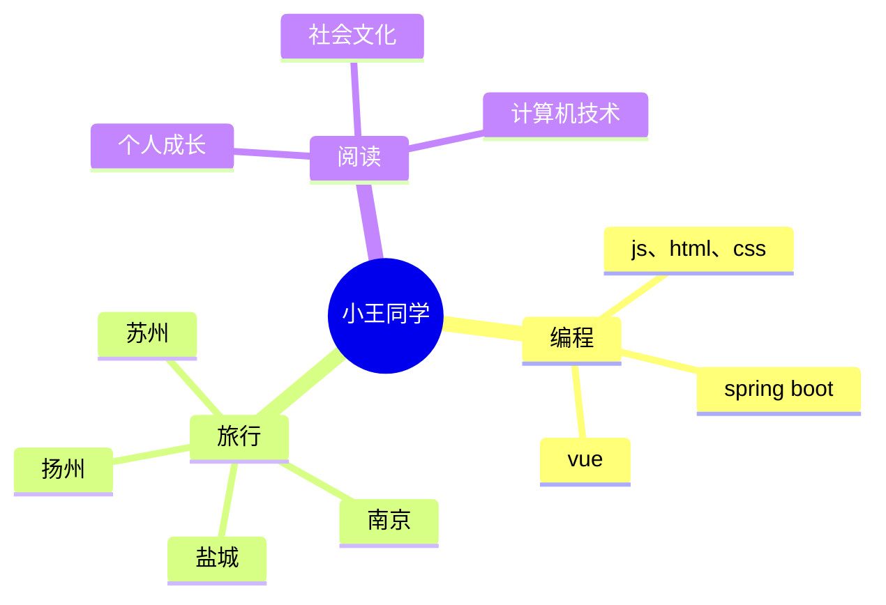

  
  <!-- dynamic typing effect 动态打字效果 -->
  

    
  

  
  <!-- knock code pictures 敲代码的图片 -->
   

  <!-- profile logo 个人资料徽标 -->
  

    
    &emsp;
    
    &emsp;
    <!-- visitor statistics logo 访问量统计徽标 -->
    
  

# Hello

<table>
<tr><td>

### 🤺 About Me

<!-- 
&emsp;&emsp;大家好，我是小王同学。
 -->
<!-- 
&emsp;&emsp;热爱编程、摄影、读书、旅行。
 -->
<!-- 
&emsp;&emsp;热爱计算机科学和IT互联网事业，励志成为一名优秀的开发者。
 -->
<!-- 
&emsp;&emsp;我们正在让这个世界变得更加美好，通过代码的重复使用和延展构建完美体系。
 -->

</td></tr>

<tr><td>

### 🏢 Work Experience

<!-- - [广州图慧信息科技有限公司](https://www.tuhuimap.com/) &emsp; 📌 2023-06-19 —— Now
  
  - 工作岗位：Web前端开发工程师（初级）
  - 工作内容：GIS相关

- [蔚来汽车科技（安徽）有限公司](https://www.nio.cn/) &emsp; 📌 2023-02-20 —— 2023-05-12
  
  - 工作岗位：Web前端开发实习生
  - 工作内容：参与一站式数据治理与研发平台 DataSight 的开发与维护工作 -->

</td></tr>

<tr><td>

### 📃 Recent Blog

<!-- START_SECTION:blog -->
<!-- * <a href='https://blog.sunguoqi.com/archives/ohmyposh' target='_blank'>Oh My Posh | Windows Terminal 美化指南</a> - 2023-07-15
* <a href='https://blog.sunguoqi.com/archives/brain' target='_blank'>小孙同学 の 第二大脑正在施工中 。。。</a> - 2023-03-26
* <a href='https://blog.sunguoqi.com/archives/20230225' target='_blank'>奔跑在自己的时区里，你好哇，我的22岁！</a> - 2023-02-25
* <a href='https://blog.sunguoqi.com/archives/github_profile_0' target='_blank'>让面试官眼前一亮，手把手带你打造个性化的 GitHub 首页</a> - 2023-01-30
* <a href='https://blog.sunguoqi.com/archives/chatgpt' target='_blank'>快速上手，教你如何将 ChatGPT 接入到微信公众号</a> - 2023-01-29 -->
<!-- END_SECTION:blog -->

</td></tr>

<tr><td>

### 🧠 Second Brain

<!-- START_SECTION:brain -->
<!-- * <a href='https://brain.sunguoqi.com/web/frontend/css/css-in-depth/test.html' target='_blank'>My Note</a> - 2023-09-07
* <a href='https://brain.sunguoqi.com/web/frontend/css/css-world/test.html' target='_blank'>My Note</a> - 2023-09-07
* <a href='https://brain.sunguoqi.com/web/frontend/js/my-notes/test.html' target='_blank'>My Note</a> - 2023-09-07
* <a href='https://brain.sunguoqi.com/web/frontend/js/professional-javascript/ch1.html' target='_blank'>JavaScript 简介</a> - 2023-08-20
* <a href='https://brain.sunguoqi.com/web/frontend/js/professional-javascript/ch10.html' target='_blank'>模块</a> - 2023-08-20 -->
<!-- END_SECTION:brain -->

</td></tr>
</table>

<!--  skill badge 技能徽章 -->
💪 正在学习

🧠 计划学习

🧰 常用的工具

<!-- svg -->

 

<!-- gif -->

    

<!-- Awesome repo 比较好的仓库-->

  

